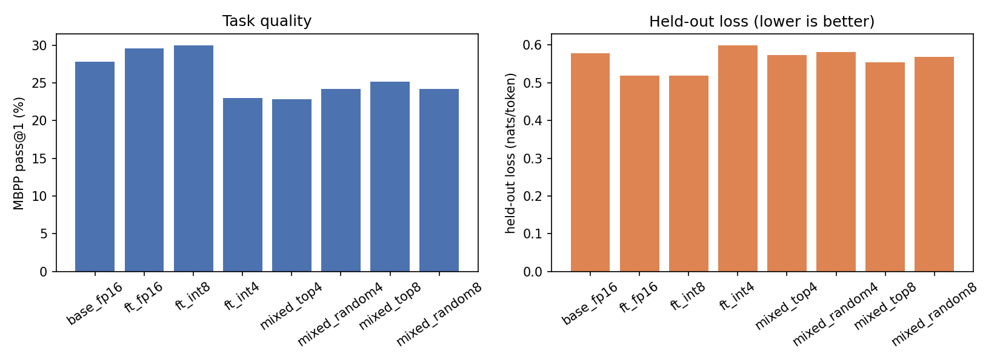
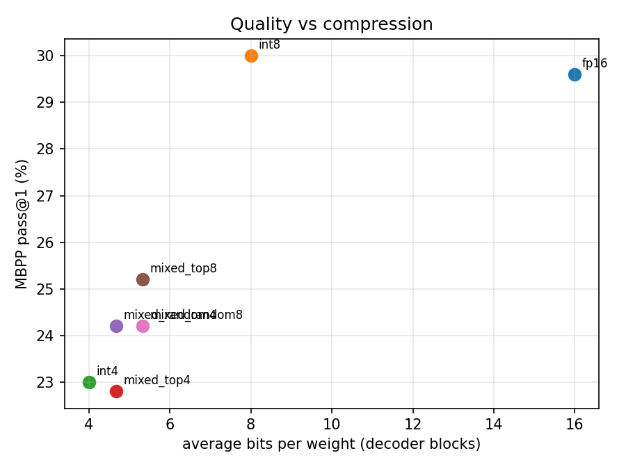
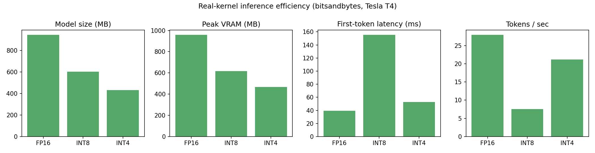
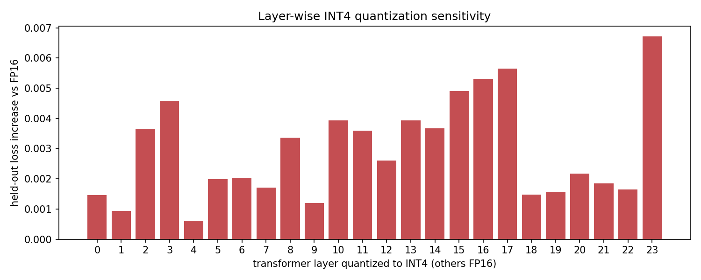
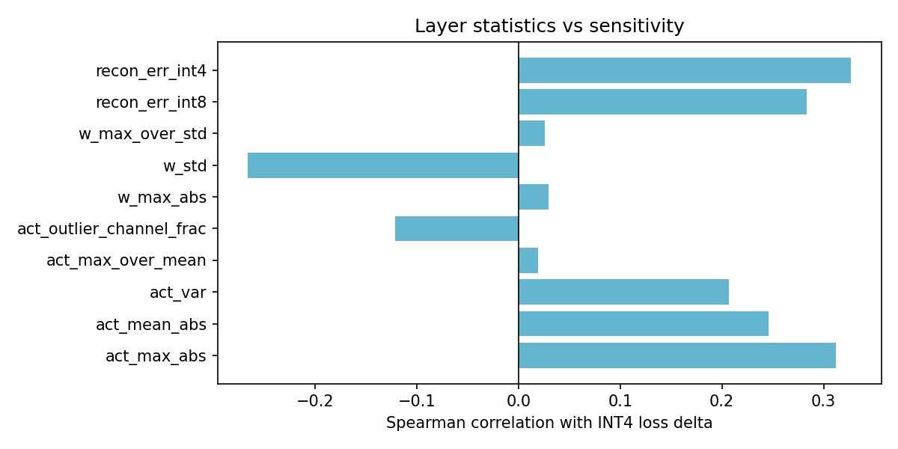

# Layer-Adaptive Low-Bit Quantization for Small Language Models

Controlled study of what happens when a small LLM is LoRA fine-tuned for code generation and then compressed to INT8 / INT4 for inference.

**Question:** How much task quality is lost going FP16 → INT8 → INT4, which transformer layers are responsible for that loss, and can a sensitivity-guided mixed-precision layout recover it while keeping most of INT4's memory savings?

> Results section below is filled in after running the pipeline. See `RUNBOOK.md` for the exact procedure.

## Setup

| | |
|---|---|
| Model | Qwen2.5-0.5B (base), 24 decoder layers |
| Fine-tuning | LoRA r=16 on 4,000 Python examples from CodeAlpaca-20k, 2 epochs |
| Task metric | MBPP test (500 problems), pass@1 by executing generated code against unit tests |
| Proxy metric | Held-out loss on 500 unseen CodeAlpaca examples (response tokens only) |
| Quality quantization | Simulated PTQ: INT8 per-channel symmetric, INT4 group-128 asymmetric, any layer set |
| Efficiency quantization | Real kernels via bitsandbytes (LLM.int8, NF4) |
| Hardware | Kaggle T4 |

Two quantization tracks on purpose. Simulated quantization gives exact per-layer control needed for the sensitivity sweep and mixed model; real kernels give honest memory and latency numbers. Simulated quant has no speed benefit and real kernels can't mix precisions per layer, so each is used for what it does well.

## Pipeline

```
01_baseline        base model quality
02_finetune        LoRA -> merge -> FP16 checkpoint -> quality
03_quantize_eval   uniform INT8 / INT4 quality
04_benchmark       VRAM, size, first-token latency, tokens/sec (bitsandbytes)
05_sensitivity     one layer at a time -> INT4, rest FP16, measure degradation
06_layer_stats     activation / weight statistics per layer, correlate with sensitivity
07_mixed_precision top-k sensitive layers INT8, rest INT4, plus random-k control
08_plots           all figures from CSVs
```

## Results

### Quality vs precision

| Variant | Avg weight bits | Held-out loss | MBPP pass@1 |
|---|---|---|---|
| Base FP16 | 16 | 0.578 | 27.8% |
| Fine-tuned FP16 | 16 | 0.519 | 29.6% |
| Fine-tuned INT8 | 8 | 0.520 | 30.0% |
| Fine-tuned INT4 | 4 | 0.599 | 23.0% |
| Mixed top-4 (INT8) / INT4 | 4.67 | 0.573 | 22.8% |
| Mixed random-4 / INT4 | 4.67 | 0.581 | 24.2% |
| Mixed top-8 (INT8) / INT4 | 5.33 | 0.555 | 25.2% |
| Mixed random-8 / INT4 | 5.33 | 0.569 | 24.2% |




LoRA fine-tuning on 4,000 Python instruction examples reduced held-out loss by 10% (0.578 -> 0.519) and gave a modest, direction-consistent gain in MBPP pass@1 (27.8% -> 29.6%), within the noise range for a 500-problem test set at this model scale.

Uniform INT8 is statistically indistinguishable from FP16 on both metrics. Uniform INT4 shows a clear, meaningful degradation: held-out loss up 15% relative, pass@1 down 6.6 points, well outside sampling noise.

### Inference efficiency (real kernels, Tesla T4)

| Precision | Model size | Peak VRAM | First token | Tokens/sec |
|---|---|---|---|---|
| FP16 | 942 MB | 958 MB | 39 ms | 27.9 |
| INT8 (bnb LLM.int8) | 601 MB | 618 MB | 155 ms | 7.5 |
| NF4 | 430 MB | 467 MB | 53 ms | 21.2 |



Memory scales down cleanly with precision. Throughput does not: INT8 is nearly 4x *slower* than FP16 on this GPU, a known limitation of bitsandbytes' mixed-precision decomposition on Turing-generation hardware (T4), which pays extra FP16 outlier-compute overhead per token that newer GPUs amortize better. NF4 avoids this and stays close to FP16 speed while using the least memory of the three. On a T4, INT4 dominates INT8 on every efficiency axis; INT8's only advantage over FP16 is memory, at a real latency cost.

### Layer-wise INT4 sensitivity



Swapping a single layer to INT4 (rest FP16) moved held-out loss by only 0.0006-0.0067 across all 24 layers, no dramatic outlier layer. Layer 23 (final layer) and layer 17 showed the largest individual deltas, but the overall curve is flat rather than spiked. This indicates INT4 error is cumulative across depth rather than concentrated in a few fragile layers: no single layer explains the 0.08 loss increase seen under uniform INT4, it emerges from many small per-layer errors compounding through the residual stream.

Per-layer MBPP pass@1 (6 most loss-sensitive layers) was too noisy at 500 problems to be informative on its own -- drops ranged from -2.0 to +0.2 points, inside the expected sampling noise band, and are not used as a ranking signal.

### What predicts sensitivity?



No activation or weight statistic significantly predicted per-layer loss delta (all p > 0.1, n=24). The closest trends were activation outlier-channel fraction (Spearman rho=0.33, p=0.12) and INT4 reconstruction error (rho=0.33, p=0.12), both positive as expected but not significant at this sample size. This is a fair result given how flat the underlying sensitivity signal is: with per-layer deltas this small, no simple statistic was going to cleanly separate them.

### Mixed precision

Despite the flat per-layer signal, ranking by loss delta and keeping the top-k layers at INT8 (rest INT4) consistently outperformed a random-k control at the same bit budget:

- **k=4** (avg 4.67 bits): top-4 loss 0.573 vs random-4 loss 0.581 -- sensitivity-guided selection recovered about 30% more of the INT4->FP16 gap than random selection at the same budget.
- **k=8** (avg 5.33 bits): top-8 loss 0.555 vs random-8 loss 0.569 -- same ~30% advantage, consistent across both budgets.

pass@1 did not confirm this cleanly (top-4 slightly below random-4, top-8 tied with random-4), consistent with the noise floor already observed in the per-layer pass@1 sweep. Loss is the primary evidence here; pass@1 is directionally supportive at best given the sample size.

**Conclusion:** individual-layer INT4 sensitivity was too weak and noisy to identify a clear set of "fragile" layers on this model, but the sensitivity ranking still carried real, repeatable signal once used to guide a top-k selection -- a consistent ~30% improvement over random placement at matched bit budgets. For a 0.5B model on this task, the practical recommendation is uniform INT8 (no quality loss, but a real latency cost on T4-class GPUs) or uniform NF4 (best size/speed tradeoff, with an acceptable quality hit); a mixed layout is worth the added complexity mainly when INT4's quality drop must be partially recovered without paying INT8's full memory or latency cost.

## Findings

1. Fine-tuning improved task-adapted quality (10% relative loss reduction), though the MBPP pass@1 gain alone was within sampling noise at this model scale.
2. INT8 post-training quantization is quality-lossless on this model but, on Tesla T4 hardware, carries a substantial throughput penalty relative to FP16 due to bitsandbytes' mixed-precision decomposition overhead; NF4 (INT4) does not share this penalty.
3. INT4 quantization causes a real, non-noise quality drop (15% relative loss increase, 6.6-point pass@1 drop), but the drop is not explained by a small number of fragile layers -- sensitivity is distributed across depth.
4. No individual activation or weight statistic significantly predicted per-layer INT4 sensitivity in this model, though outlier-channel fraction and reconstruction error showed the (non-significant) expected direction.
5. A sensitivity-guided mixed INT4/INT8 layout recovered meaningfully more quality than random layer placement at matched bit budgets (~30% more of the gap closed at both k=4 and k=8), showing the ranking has practical value even when no individual layer stands out.

## Repo layout

```
configs/      experiment config (one YAML per model)
src/          library code: data, model, quant, evaluate, benchmark, stats, utils
scripts/      numbered pipeline steps, each writes CSVs to results/
results/      CSVs (committed), generations/ (gitignored)
figures/      PNGs produced by 08_plots.py
tests/        unit tests for the quantizer
RUNBOOK.md    step-by-step procedure including Kaggle setup
```

## Reproduce

```bash
pip install -r requirements.txt
for s in 01_baseline 02_finetune 03_quantize_eval 04_benchmark 05_sensitivity 06_layer_stats 07_mixed_precision 08_plots; do
  python scripts/$s.py --config configs/qwen0.5b.yaml
done
```

## Not in scope

No CUDA kernels, no QAT, no GPTQ/AWQ reimplementation, no 7B+ models, no serving stack. The contribution is the controlled experimental analysis and the sensitivity-guided mixed-precision layout.
